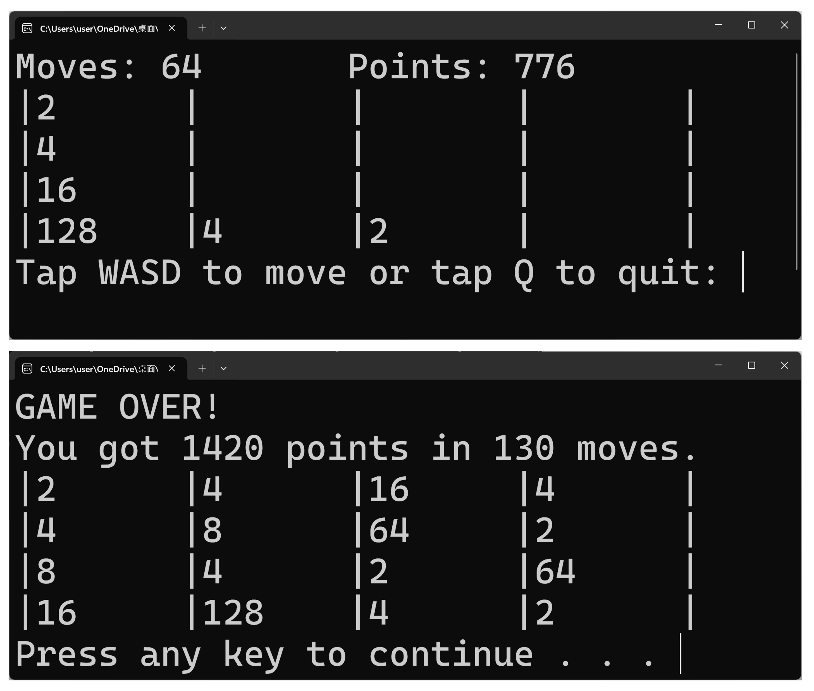

# 2048 遊戲

這是用C++寫的2048遊戲專案，遊戲規則就和原始版本的2048相同。透過按方向鍵或是WASD可以移動數字，每次移動會在空白處隨機產生一個數字2或4，相同的數字會合併，合併後可以得到分數。若合成出數字"2048"即獲勝；若全部格子都滿了即遊戲結束。

## 開發動機
透過實作2048遊戲，檢驗自己整學期的C++學習成果。將片段的程式碼練習轉換為一個具有完整功能的專案，同時累積程式開發的經驗。

## 專案架構

- 資料處理：`newBlock()`實作隨機生成演算法，產生數字2或4在空白區塊。`move(char)`實作移動與合併演算法，依據玩家指令移動與合併相加數字。
- 互動介面：`print()`負責顯示遊戲畫面，並固定數字方格大小確保輸出介面整齊。`main()`裡面的`_getch()`負責偵測玩家的方向與退出指令。
- 狀態管理：`movable()`偵測是否存在可移動路徑，決定了遊戲的繼續與結束。
`achieve()`偵測達標條件，判斷玩家是否達成目標數字2048。

## 執行環境
- 語言：C++
- 作業系統：Windows（因為引入了`conio.h`標頭檔，它是Windows上的函式庫）

## 截圖 
